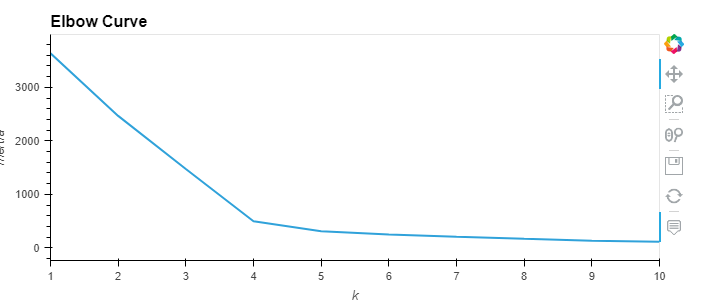
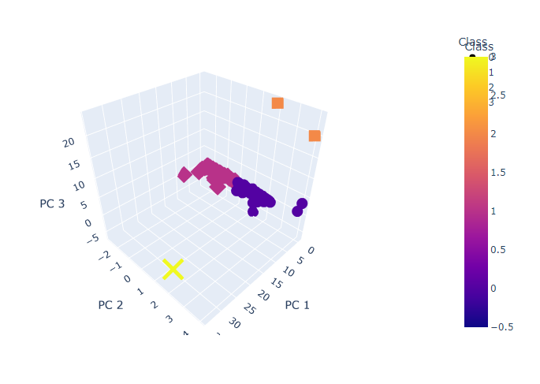
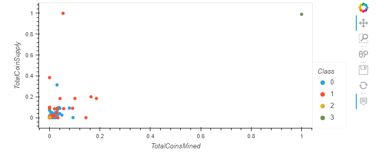

# Cryptocurrencies
## Purpose
To group different cryptocurrencies and classify them to help guide future investments.
## Process
Before running the crypto through any ML models, the data had to be processed. After filtering for mined currencies, and currencies that are currently being traded, I ended up with 532 coins to be clustered.

From there, I used PCA to reduce the dimensions to 3. I used a k-means algorithm and an elbow curve to determine the number of clusters. Here is the elbow curve:

As you can see, a good number of clusters is 4. After classifying the cryptocurrencies, I plotted the distribution:

Most of the currencies fall into two clusters, with a handful of currencies falling into the other two clusters. Using real dimensions, it isn't obvious where the split in the different currencies lie, but one coin, BitTorrent, sticks out. BitTorrent is also in a cluster all its own. This plot below, comparing Total Coin Supply and Total Coins Mined, highlights the outlier;

That's the currencies all grouped!
## Results
The currencies, with the reduced dimensionality, did group into 4 different clusters. Something that wouldv'e added to this clustering is showing how well the PCA did at perserving data with `pca.explained_variance_ratio_` which could guide how this clustered data is interpreted.

As this was simply exploratory, there is plenty of ground to break when in comes to interpretation and predictive modeling. However, that is beyond the scope of this code.
